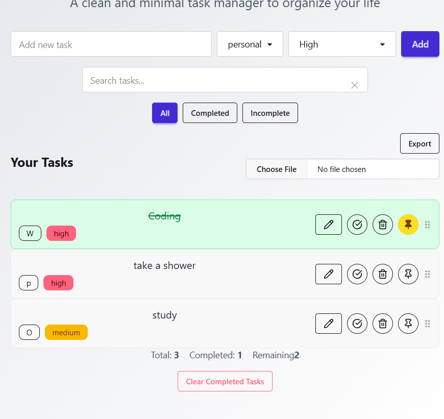
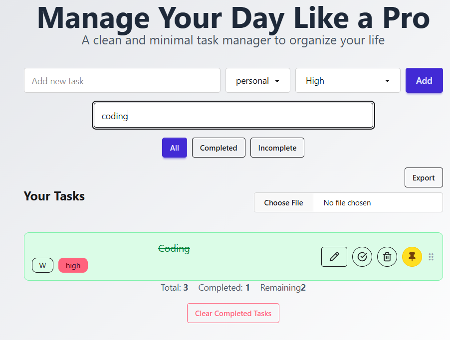

#  ToDoApp — Advanced & Elegant Task Manager

A highly interactive and well-architected task management web application built with **React + TypeScript**, showcasing best practices in component design, state management, UX, and progressive enhancement.

[ Live Demo](https://todolistdeployed.netlify.app/) • [ GitHub Repo](https://github.com/mohammadhbi/TodoList)

---

##  Features

-  Add / Edit / Delete tasks with a clean UI
-  Pin important tasks for quick access
-  Real-time search with instant filtering
-  Smart filters: All / Completed / Incomplete
-  Task grouping by category
-  Priority levels: Low / Medium / High (with color badges)
-  Drag & Drop task reordering (powered by `@dnd-kit`)
-  Persistent storage via `localStorage`
-  Export & Import tasks as `.json` files
-  Smooth animations using `framer-motion`
-  Responsive design with **TailwindCSS** + **DaisyUI**
-  Fully modular, scalable, and strongly typed codebase

---

##  Screenshots





---

##  Tech Stack

| Tool            | Purpose                            |
|-----------------|-------------------------------------|
| React + Vite    | Frontend Framework                  |
| TypeScript      | Type safety and developer experience |
| TailwindCSS     | Utility-first styling               |
| DaisyUI         | UI components and themes            |
| Framer Motion   | Animations and transitions          |
| DnD Kit         | Drag & Drop interaction             |
| LocalStorage    | Data persistence                    |

---

##  Architecture & Design Decisions

- Components are modular, reusable, and fully typed with custom props.
- State is managed using React hooks with top-level control in `App.tsx`.
- `TaskItem` is decoupled for full interactivity and animation control.
- Drag & Drop logic is isolated and uses a custom drag handle to prevent UI conflicts.
- Code is written with scalability, maintainability, and readability in mind (folder structure, separation of concerns, etc.).

---

##  Folder Structure

```bash
src/
├── components/
│   ├── AddTaskForm.tsx
│   ├── TaskList.tsx
│   ├── TaskItem.tsx
│   ├── TaskStats.tsx
│   ├── FilterControls.tsx
│   ├── SearchBar.tsx
│   └── TaskBackupControls.tsx
├── types/
│   ├── Task.ts
│   └── Props.ts
├── App.tsx
└── main.tsx
